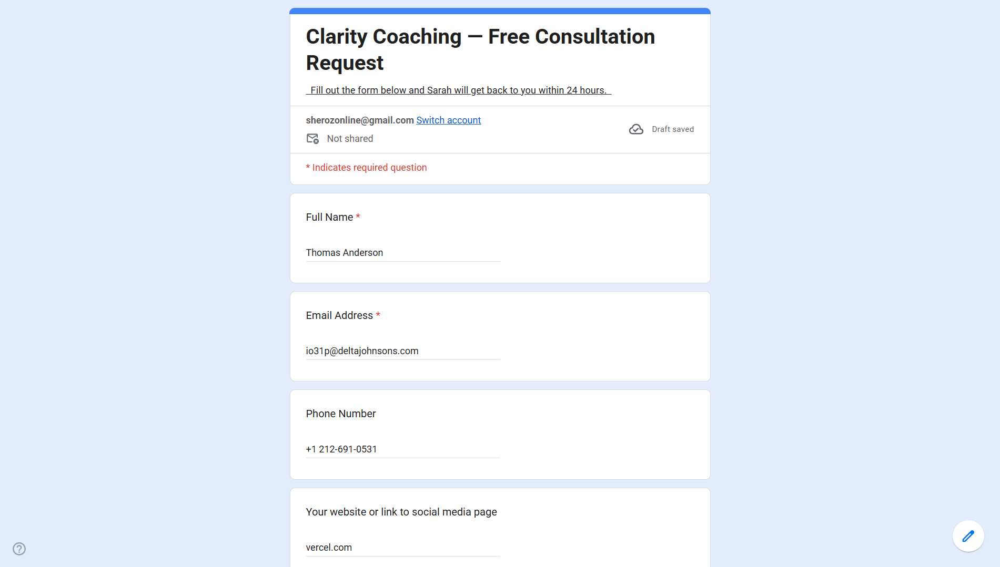
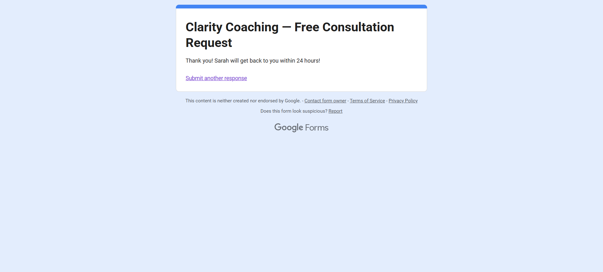
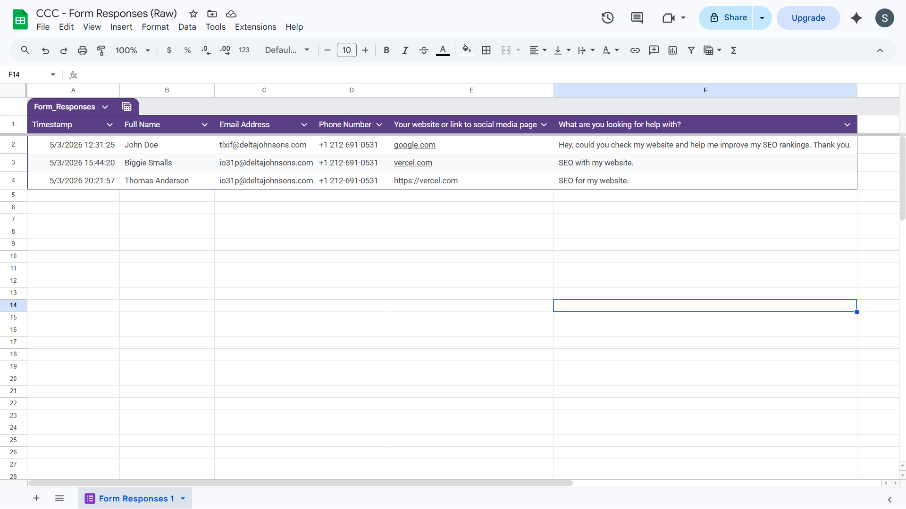
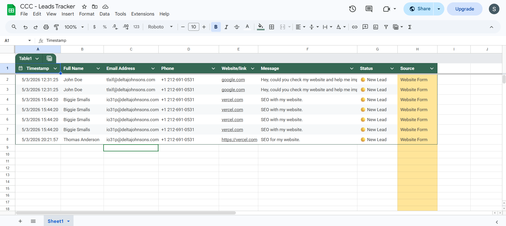
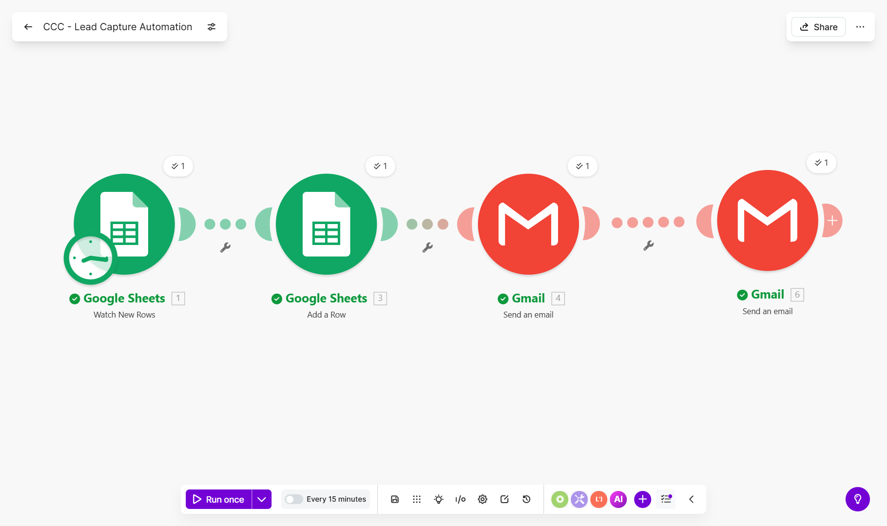
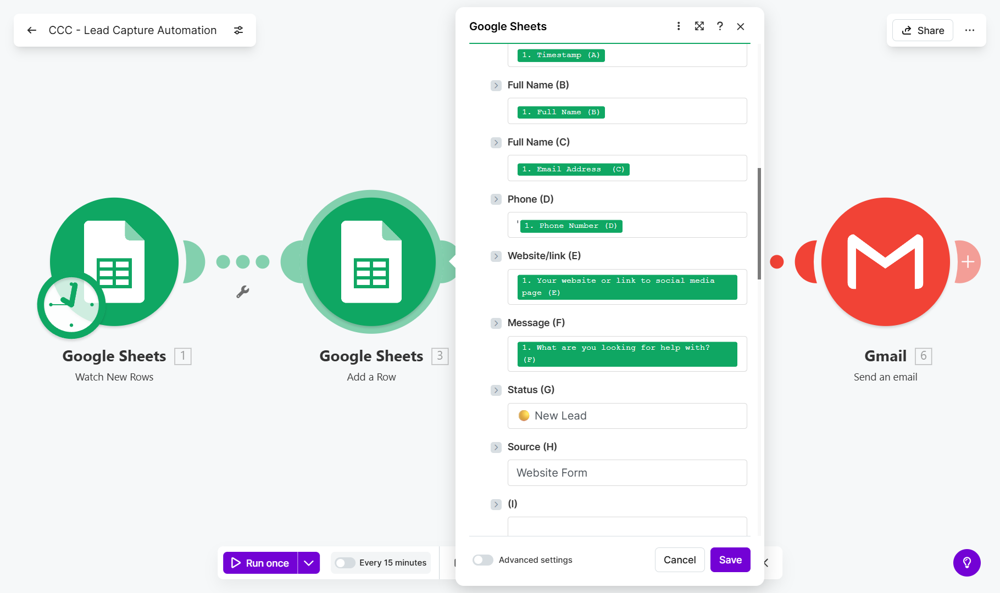
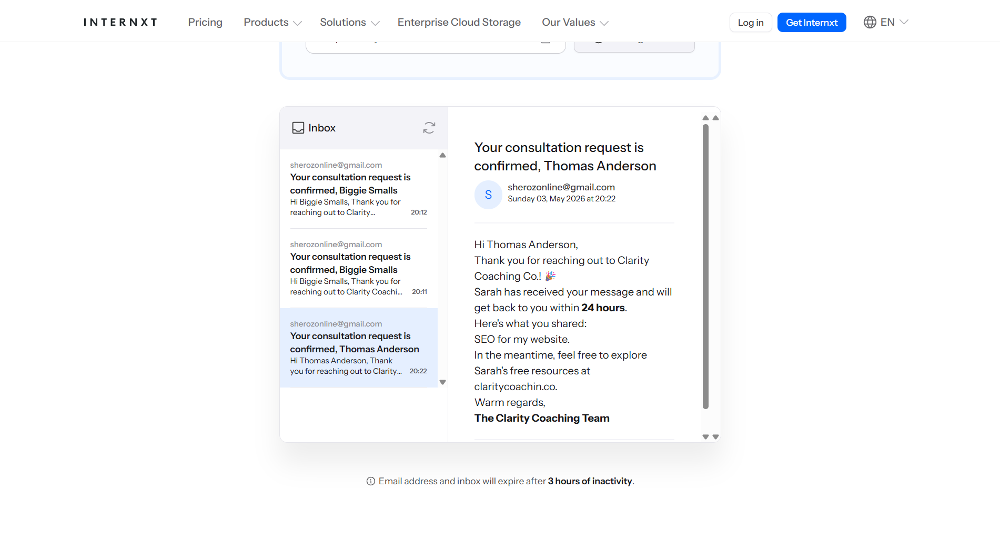
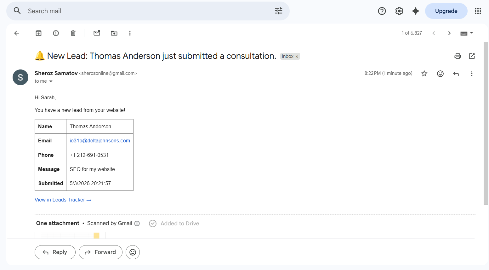

# 🏠 Automated Lead Capture System
### Portfolio Project #1 - Make.com Automation

> A fully automated lead capture pipeline built for **Clarity Coaching Co.**, a fictional business coaching practice. Every new website inquiry is instantly logged, acknowledged, and flagged - with zero manual effort from the business owner.

---

## 📌 The Problem

Sarah Mitchell runs a solo coaching business. Her website had a contact form, but:

- Inquiries landed in her inbox with no structure or tracking
- She replied manually to every single submission
- There was no central log of leads - no way to spot patterns or follow up reliably
- Leads occasionally slipped through the cracks entirely

**The ask:** Automate the full intake process so every new lead is captured, logged, and acknowledged the moment it arrives.

---

## ✅ The Solution

A 4-module Make.com scenario that triggers on every new form submission and handles everything downstream automatically.

**What happens when someone fills out the contact form:**

1. Make.com detects the new submission in Google Sheets
2. A clean, timestamped row is added to the Leads Tracker with a `🟡 New Lead` status
3. The submitter receives a personalised Thank You email within minutes
4. Sarah receives an internal notification email with the full lead details and a direct link to the tracker

---

## 🛠️ Tech Stack

| Tool | Purpose |
|---|---|
| Google Forms | Lead intake form (simulates a website contact form) |
| Google Sheets | Raw response log + clean Leads Tracker |
| Make.com | Automation engine (scenario with 4 modules) |
| Gmail | Outbound emails - Thank You + owner notification |

**No paid tools required.** Everything runs on free tiers.

---

## 🗂️ Project Structure

```
├── Google Form         → "Free Consultation Request" (4 fields)
├── Google Sheets
│   ├── Raw Responses   → Auto-generated by Google Forms (read-only)
│   └── Leads Tracker   → Cleaned, enriched log (written by Make)
└── Make.com Scenario
    ├── Module 1        → Watch New Rows (Google Sheets trigger)
    ├── Module 2        → Add Row to Leads Tracker
    ├── Module 3        → Send Thank You email (to submitter)
    └── Module 4        → Send notification email (to business owner)
```

---

## ⚙️ How It Works

### Data Flow

```
Website visitor fills out Google Form
            ↓
  Google Sheets (raw responses)
            ↓
     Make.com detects new row
            ↓
    ┌────────────────────┐
    ▼                    ▼
Leads Tracker       Gmail × 2
(log + status)  (Thank You + Notification)
```

### Leads Tracker Schema

| Column | Source |
|---|---|
| Timestamp | Make.com - `formatDate(now)` |
| Full Name | Mapped from form |
| Email | Mapped from form |
| Phone | Mapped from form |
| Message | Mapped from form |
| Status | Hardcoded by Make - `🟡 New Lead` |
| Source | Hardcoded by Make - `Website Form` |

---

## 📸 Screenshots

> *Full screenshot walkthrough below. Each image corresponds to a step in the build.*

**1. Google Form - User-facing view**





**2. Raw Responses Sheet - Auto-generated by Google Forms**



**3. Leads Tracker - Populated by Make.com**


**4. Make.com Scenario Canvas - Full 4-module flow**



**5. Module 2 - Row mapping configuration**



**6. Thank You Email - Received by submitter**



**7. Notification Email - Received by business owner**



---

## ⚠️ Limitations & Production Considerations

| Limitation | Detail |
|---|---|
| **Polling delay** | Make.com's free tier checks for new rows every 15 minutes - not real-time. Upgrade to a paid plan or use a webhook-based trigger for instant processing. |
| **Gmail sending limits** | Gmail's free tier caps at 500 emails/day via API. For high-volume lead intake, switch to a transactional email service (Brevo, Postmark, etc.). |
| **No duplicate check** | If the scenario runs manually and the same row is unprocessed, it can fire twice. In production, add a filter module to check for existing entries before writing. |
| **Single sheet source** | This scenario watches one specific sheet tab. If the form structure changes (columns shift), the field mapping in Make breaks and needs updating. |

---

## 💡 Possible Enhancements

- **CRM integration** - push new leads directly to HubSpot, Notion, or Airtable instead of Google Sheets
- **Lead scoring** - add a Make.com filter to route high-priority leads (e.g. budget mentioned in message) to a separate "Hot Leads" sheet
- **Follow-up sequence** - trigger a 3-email drip sequence 24h, 72h, and 7 days after submission
- **Slack notification** - replace or supplement the email notification with a Slack message for faster response
- **AI qualification** - pass the message field through Claude or GPT to auto-summarise intent and flag urgency

---

## 👤 About This Project

Built by **Sheroz** as Portfolio Project #1 in an automation consulting portfolio.

This project demonstrates:
- End-to-end automation design from intake to notification
- Multi-module Make.com scenario building
- Real-world data mapping and transformation
- Client-focused documentation and handoff thinking

📬 Interested in a similar setup for your business? [Get in touch →](mailto:sherozonline@gmail.com)

---

*Built with Make.com free tier · Google Workspace · No code required*
